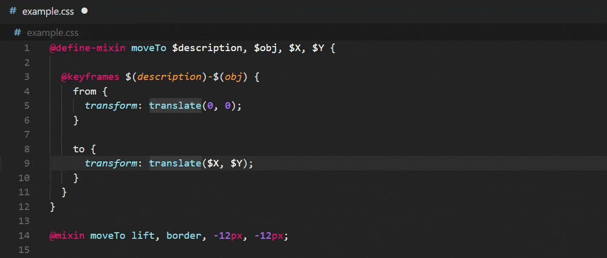

# transform-function-no-whitespace

Disallow whitespace between transform functions and their parentheses

For projects that would like to safeguard their transform functions when used with CSS, SCSS, or PostCSS variables.



## Installation

```shell
npm i -D stylelint stylelint-transform-function-no-whitespace
```

## Setup

```js
// stylelint.config.js
/* ESM pattern is preferred, as CommonJS support will be deprecated
in Stylelint's next major release (17.0.0) */

export default {
  plugins: [
    // your other pluginsv
    "stylelint-transform-function-no-whitespace",
  ],
  rules: {
    // your other rules
    "plugin/transform-function-no-whitespace": true,
  },
};
```

## Documentation

Please refer to [GitHub README](https://github.com/qwloh/stylelint-transform-function-no-whitespace#readme) for full documentation.
