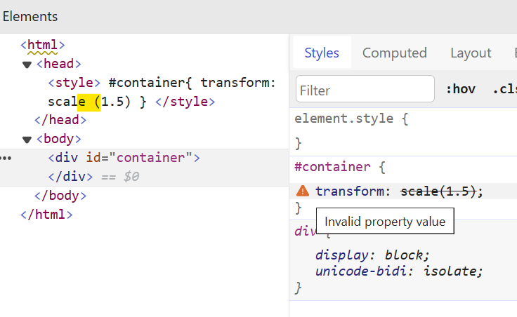

<div align="center">

# transform-function-no-whitespace

Disallow whitespace between transform functions and their parentheses

For projects that would like to safeguard their transform functions when used with CSS, SCSS, or PostCSS variables.

</div>

<!-- to be added after the package is published -->
<!-- npm tag -->
<!-- coverage badge -->

## Problem

When there are whitespaces between tranform functions and their parentheses, browsers deemed them as invalid values for the CSS `transform` property.


<div align="center">

</div>

Yet, two most common CSS formatters, VS Code's built-in CSS Language Features and Prettier, do not warn users when whitespaces are accidentally left in, nor remove them on format.

|**VS Code's built-in CSS Language Features** | **Prettier** |
|---|---|
| | |

Stylelint, on the other hand, can be configured to address this issue by turning on its `declaration-property-value-no-unknown` rule. However, this is

## Installation

```shell
npm install --save-dev stylelint stylelint-transform-function-no-whitespace
```

## LICENSE

[MIT](https://github.com/qwloh/stylelint-transform-function-no-whitespace/blob/main/LICENSE)
