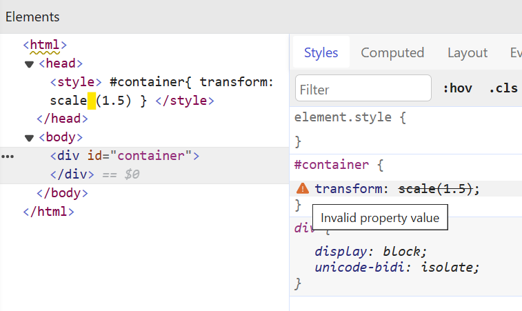

<div align="center">

# transform-function-no-whitespace

Disallow whitespace between transform functions and their parentheses

For projects that would like to safeguard their transform functions when used with CSS, SCSS, or PostCSS variables.

</div>

<!-- to be added after the package is published -->
<!-- npm tag -->
<!-- coverage badge -->

## Problem

When there are whitespaces between tranform functions and their parentheses, browsers deemed them as invalid values for the CSS `transform` property.



Yet, two most common CSS formatters, VS Code's built-in CSS Language Features and Prettier, do not warn users when whitespaces are accidentally left in, nor remove them on format.

|VS Code's built-in CSS Language Features|
|:---|
||
|**Prettier**|
||

### Existing Stylelint Rule

A partial solution to this issue is Stylelint's `declaration-property-value-no-unknown` rule. It enforces strict validation of CSS property values, and as part of its validation flags standalone transform functions that are not followed immediately by brackets as invalid.

However, this rule is only applicable to plain CSS project. According to [the rule's documentation](https://stylelint.io/user-guide/rules/declaration-property-value-no-unknown/), we "should not turn it on for CSS-like languages, such as Sass or Less, as they have their own syntaxes."

Indeed, the rule [cannot parse dollar variables used in SCSS](/readme_assets/docs/footnotes.md) (which has a closer form to CSS than Sass or Less) or in [PostCSS files](//readme_assets/docs/footnotes.md). In fact, even in standard CSS projects, it stops catching standalone transform functions when [native CSS variables](/readme_assets/docs/footnotes.md) are involved.

One could try to make the rule work with these variables by messing with its configuration, that is, by providing a regex to `ignoreProperties.transform` in the rule's secondary option to describe a new acceptable property value pattern for `transform` that accounts for the use of variables. But constructing such regex is not trivial, as `transform` takes value in a wide range of forms, ranging from non-functional keywords, like `none` and `initial`, to more than a dozen transform functions that take varying number of arguments (consider `matrix3d()`, specified with 16 values, and `translateX()`, which accepts only one), and the combination of any number of these functions.

## Solution

This stylelint plugin provides a simple rule to detect unwanted whitespace between a transform function and its parentheses.


In the clip above, it is demonstrated with dollar variables in a PostCSS file. But since the rule is agnostic towards the content passed as the transform function's arguments, it also :-

* [works with CSS Variables ↗](/readme_assets/demo/no-whitespace-css-var.gif)
* [works with SCSS dollar variables ↗](/readme_assets/demo/no-whitespace-scss-var.gif)
* [works with Multiple transform functions ↗](/readme_assets/demo/multiple_transform_fn.png)

The rule does *not* support [Autofix](#autofix).

## Installation

```shell
npm i -D stylelint stylelint-transform-function-no-whitespace
```

## Setup

In `stylelint.config.js`, add the plugin and turn on its rule.

```js
// stylelint.config.js
/* ESM pattern is preferred, as CommonJS support will be deprecated
in Stylelint's next major release (17.0.0) */

export default {
  plugins: [
    // your other plugins
    "stylelint-transform-function-no-whitespace",
  ],
  rules: {
    // your other rules
    "plugin/transform-function-no-whitespace": true,
  },
};
```

### 👋 For First-time Stylelint Users

If you come from Prettier and are considering switching to Stylelint due to Prettier's limited configuration options, you first need to setup Stylelint on your project in order to use this plugin. You'll need four things, assuming you are using VS Code as your IDE:

1. `stylelint` installed as `devDependencies` on your project.
2. A `stylelint.config.js` in your project's root directory. I recommend starting with [this config](/readme_assets/docs/recommended-config.md).
3. Install Stylelint's [official extension](https://marketplace.visualstudio.com/items?itemName=stylelint.vscode-stylelint) in VS Code.
4. In VS Code's user or workspace settings, configure (a) the files Stylelint should validate, by providing the file extensions, and (b) VS Code to run Stylelint with `--fix` flag on save to get Prettier-like format-on-save behavior.

    ```jsonc
    {
      // default: ["css", "postcss"]
      "stylelint.validate": ["css", "postcss", "scss"];

      // unlike formatters which are usually set by `editor.defaultFormatter`
      // linters usually require `codeActionsOnSave` so that they could be run with the --fix flag
      "editor.codeActionsOnSave": {
        "source.fixAll.stylelint": "explicit"
      }
    }
    ```

    :bulb: It's always a good idea to **restart VS Code** after adding new configs to ensure that the latest settings are loaded.

## Usage

After updating `stylelint.config.js`, **restart VS Code**. You should now see warning lines under your code if you add spaces after your transform functions.

### Options

#### `true`

Turn on the rule. (use `null` to turn the rule off, per Stylelint's convention)

### Optional Secondary Options

This plugin does not have any secondary option.

### Autofix

When a rule supports autofix, Stylelint can apply fixes to the source code automatically when it is violated, i.e. performing what we loosely perceived as "formatting". When a rule doesn't, the editor raises errors as squiggly lines under the code, but no formatting will occur, and the user must resolve the error manually.

**This plugin does NOT support autofix**; it only highlights the presence of extra whitespaces. If you need the plugin to not only raise errors, but also remove the whitespaces for you when you run your linting/formatting command, let me know by opening an issue.
