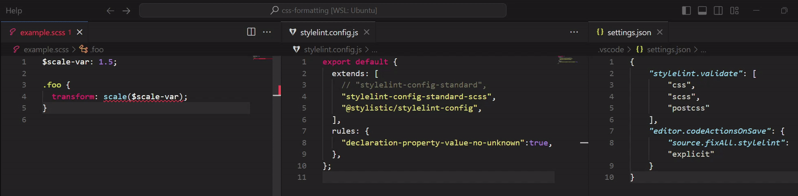
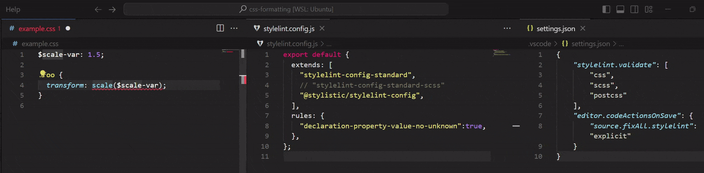
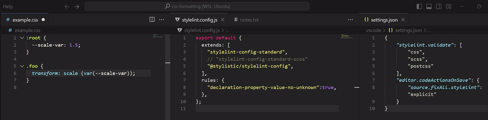

# Footnotes

1. Limit of Stylelint's `declaration-property-value-no-unknown` [↩](https://github.com/qwloh/stylelint-transform-function-no-whitespace?tab=readme-ov-file#existing-stylelint-rule)

    |**SCSS Variables**|
    |:---|
    ||
    |**Dollar Variables in PostCSS**|
    ||
    |**Native CSS Variables**: Dangling transform functions that the rule would otherwise catch are ignored|
    ||

    Note:

    It is technically possible to make the rule work with these variables by playing with the rule's secondary option, that is, by providing a regex to `ignoreProperties.transform` to describe a new acceptable property value pattern for `transform` that accounts for the use of variables.

    But constructing such regex is not trivial, as `transform` takes value in a wide range of forms, ranging from non-functional keywords, like `none` and `initial`, to more than a dozen transform functions that take varying number of arguments (consider `matrix3d()`, specified with 16 values, and `translateX()`, which accepts only one), and the combination of any number of these functions.
