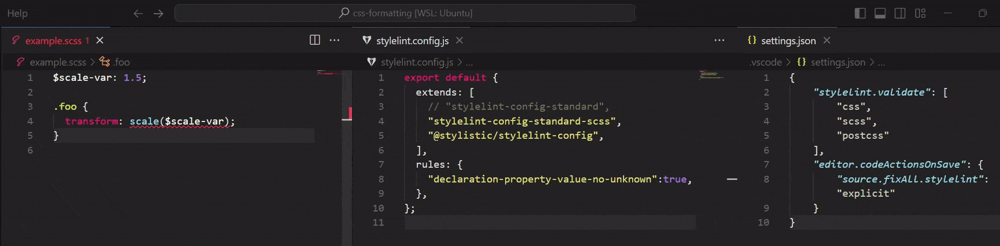

# Footnotes

1. Limitations of Stylelint's `declaration-property-value-no-unknown` [↩](https://github.com/qwloh/stylelint-transform-function-no-whitespace?tab=readme-ov-file#see-behavior)

    |**SCSS Variables**|
    |:---|
    ||
    |**Dollar Variables in PostCSS**|
    ||
    |**Native CSS Variables**: Dangling transform functions that the rule would otherwise catch are ignored|
    ||
